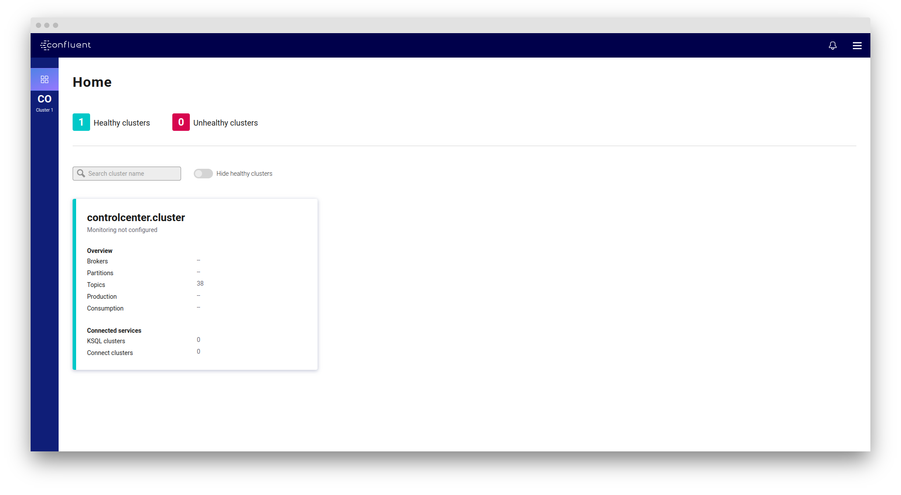

# Kafka-PostgreSQL Integration

This folder demonstrates the integration of Apache Kafka for message processing and PostgreSQL for database storage using Go and Python.

Features
1. Kafka Message Processing: Includes Go code for consuming messages from Kafka topics.
2. PostgreSQL Database Storage: Utilizes Go's database/sql package to insert received messages into a PostgreSQL database.
3. Environment Variable Handling: Uses github.com/joho/godotenv in Go to load environment variables from a .env file, enabling secure configuration management.
4. Python Kafka Producer: Demonstrates how to produce messages to Kafka topics using Python, including JSON data and image data.
5. Image Processing: Includes Python code for reading images, resizing them, and sending them to Kafka topics.

## Requirements

Install the package:

```
pip3 install kafka-python
```

- Go 1.15+
- Python 3.6+
- Kafka broker running on localhost:9092 or as specified in the code.
- PostgreSQL database accessible with the provided credentials.

## Docker

```
docker build -t chiehpower/kafka_practice:v0.1 .    
```

Then access to WebServer container. If you wanna implement Go file, just use `go mod tidy` to set up the relevant files.

Start the services.
```
docker-compose up -d
```

## Usage

Simple checking:

1. Start the consumer.
    ```
    docker-compose exec kafka kafka-console-consumer.sh --topic baeldung_linux --from-beginning --bootstrap-server kafka:9092
    ```
2. Start the producer.
    ```
    docker-compose exec kafka kafka-console-producer.sh --topic baeldung_linux --broker-list kafka:9092
    ```
    You can start type the message, and then you can check the message in the consumer side.

### Consumer Part:

For setup Go env, please use the `go mod tidy` command first.

The example `client.go` is to showcase how to extract the image and save it as a `received_image_client.jpg` file.

```
cd /kafka
go run client.go
```

If you wanna try the integration example with SQL DB.

```
go run client_db.go
```

### Producer Part:

> [!IMPORTANT]  
> Please copy `.env.sample` file to `.env` and set up the environment variables.

```
cd /kafka
python3 producer.py
```

You can monitor the messages consumed by the Go consumer and stored in PostgreSQL.

## UI

*Please turn on the container of the control-center.*

You can access the dashboard: `0.0.0.0:9021`



 
